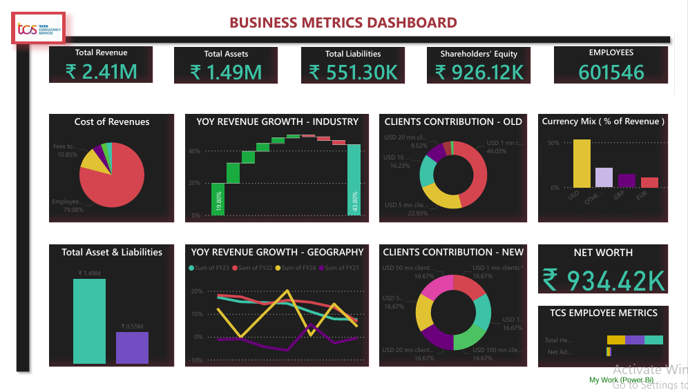

# 📊 TCS Financial Performance Dashboard – Q2FY25




## 📌 Project Overview

This project is an interactive **Financial Performance Dashboard** built using **Power BI**, analyzing **TCS Q2 FY25 performance data**.

The dashboard provides insights into:

* Revenue Growth
* Profit Margins
* Segment-wise Performance
* Geographic Revenue Distribution
* YoY & QoQ Comparisons
* Key Financial KPIs

This project demonstrates strong concepts of:

* Data Cleaning
* Data Modeling
* DAX Calculations
* KPI Design
* Business Intelligence Reporting

---

## 🖥️ Dashboard Preview

> 📌 Add your dashboard screenshot here
> After uploading `dashboard.png` to your repo, use:

```md

```

---

## 📂 Project Files

* `TCS DASHBOARDS.pbit` – Power BI Template File
* `dashboard.png` – Dashboard Screenshot
* `README.md` – Project Documentation

---

## 🛠️ Tools & Technologies Used

* **Power BI Desktop**
* **Power Query Editor**
* **DAX**
* Data Modeling (Star Schema Concept)
* Financial KPI Analysis

---

## 📊 Key KPIs Implemented

* Total Revenue
* Net Profit
* Operating Margin
* Revenue by Geography
* Revenue by Business Segment
* YoY Growth %
* QoQ Growth %

---

## 📈 Business Insights Extracted

* Identified key revenue-contributing regions.
* Compared quarterly growth trends.
* Analyzed segment-level contribution.
* Highlighted profitability patterns.

---

## 🧠 What I Learned

* Designing professional financial dashboards
* Writing optimized DAX measures
* Applying real-world business intelligence concepts
* Data storytelling using visuals

---

## 🚀 How to Use

1. Download the `.pbit` file from this repository.
2. Open it in **Power BI Desktop**.
3. Connect to the dataset (if prompted).
4. Explore interactive visuals.

---

## 📌 About Me

👤 **Dheeraj R. Singh**
📎 GitHub: [https://github.com/DHEERAJ09R08SINGH](https://github.com/DHEERAJ09R08SINGH)
🔗 LinkedIn: *(Add your LinkedIn profile link here)*

Aspiring Data Analyst | Power BI Developer | Excel Enthusiast

---

## ⭐ If you like this project

Give it a ⭐ on GitHub and feel free to connect with me!

---

If you want, I can also generate:

* 🔥 A more advanced professional README (with sections like architecture & DAX formulas)
* 🎯 A recruiter-focused version
* 🏢 A corporate-style documentation version
* 📊 README for multiple dashboards in one repo
* 📝 A LinkedIn post for this exact GitHub upload

Tell me which version you want 👌
